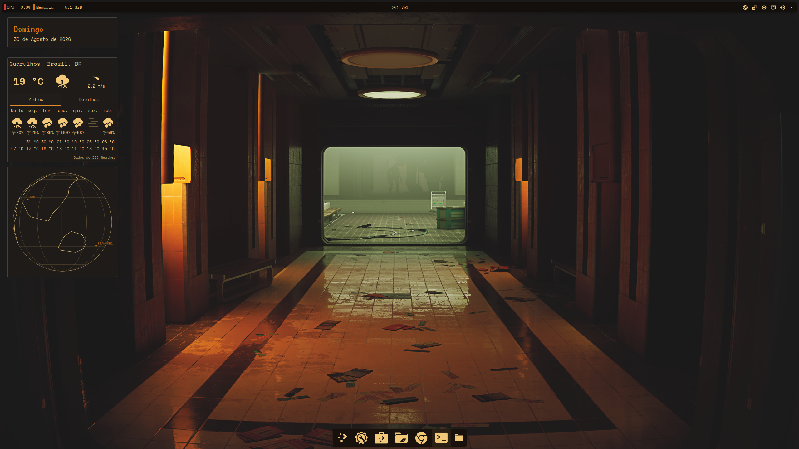
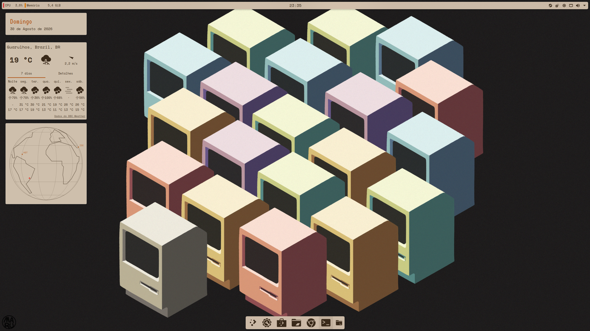
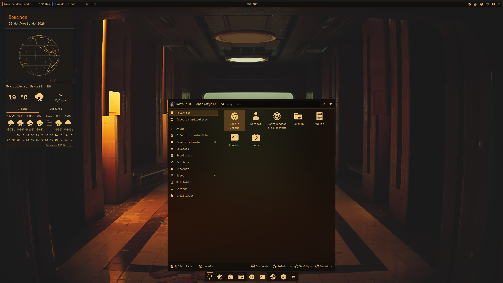
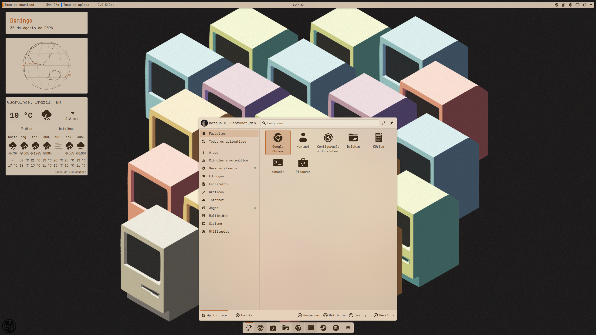

# Cassette Futurism — KDE Plasma rice

Retro-analog aesthetic for KDE Plasma 6 on Fedora KDE: amber CRT terminal in
dark mode, beige industrial in light mode.

## Screenshots

| Dark | Light |
| --- | --- |
|  |  |
|  |  |

## What's included

- **Color schemes** (`color-schemes/`): `CassetteFuturismDark` (amber on
  near-black) and `CassetteFuturismLight` (rust on warm beige).
- **Wallpapers** (`wallpapers/`): dark is a retro amber-lit sci-fi corridor
  ([source](https://wallhaven.cc/w/gwdgrd)), light is an isometric grid of
  vintage pastel Macintoshes ([source](https://wallhaven.cc/w/2y77v9)), both
  from Wallhaven. A green-toned retro office alternate
  ([source](https://wallhaven.cc/w/qroq77)) sits in `wallpapers/alt/` if you
  want to swap it in.
- **Icons** (`icons/yet-another-monochrome-icon-set/`): vendored copy of
  [Yet Another Monochrome Icon Set](https://bitbucket.org/dirn-typo/yet-another-monochrome-icon-set)
  (YAMIS) by dirn-typo, GPLv3. Pure black/white shape-only icons that
  auto-invert per background (`FollowsColorScheme=true`), so one icon theme
  covers both variants. Falls back to
  [Papirus](https://github.com/PapirusDevelopmentTeam/papirus-icon-theme)
  (installed by the script, folders recolored orange via
  [papirus-folders](https://github.com/PapirusDevelopmentTeam/papirus-folders))
  for anything YAMIS doesn't have.
- **Cursor**: [Bibata Original Amber](https://github.com/ful1e5/Bibata_Cursor).
  Not vendored, fetched by the installer.
- **Fonts** (`fonts/`): Space Mono for UI/system, VT323 for terminal/CRT
  display. Both Google Fonts, OFL licensed.
- **Konsole** (`konsole/`): terminal profile and colorscheme, kept here so a
  fresh install doesn't lose it.
- **Global Theme** (`look-and-feel/`): two Plasma Look and Feel packages
  (`com.hcristosm.cassettefuturism.dark`/`.light`) bundling color scheme,
  wallpaper, icons, cursor, and panel layout into one entry each under
  System Settings → Appearance → Global Theme.
- **Panel layout**: thin top bar (audio visualizer left, time-only clock
  centered, system tray right) and a bottom panel trimmed down to
  launcher/pager/taskbar. Baked into the Global Theme packages'
  `layouts/org.kde.plasma.desktop-layout.js`, and applied directly by
  `install.sh` via `qdbus-qt6`.
- **Desktop widgets**: a BBC weather widget (preconfigured for Guarulhos, SP)
  stacked above a date-only readout (weekday, day, month, year, no clock
  face, self-themed off the active color scheme). Both sit top-left, baked
  into the layout script. A slow-spinning wireframe globe with an optional
  satellite overlay lives here too, but isn't auto-placed, see
  `plasmoids/README.md`.
- **Widgets** (`plasmoids/`): full breakdown in `plasmoids/README.md`,
  covering the vendored `Audio.Wave.Widget` (fallback visualizer),
  `com.hcristosm.cassettefuturism.datewidget`, the globe widget, and
  optional Kurve (preferred visualizer, needs a native build).
- **Window decoration** (`kde-configs/breezerc`): flat Breeze, no outline on
  the close button, small buttons, no border on maximized windows, plus
  `BorderSize=None` in `kwinrc`. Gets Breeze (Konsole, Dolphin, System
  Settings) closer to Chrome's chromeless look. Chrome draws its own
  titlebar on Wayland so it won't match exactly, but you can set the same
  accent color from `chrome://settings/appearance` → Colors (`#E0873A` dark,
  `#B5622A` light).

## Install (fresh Fedora KDE system)

```sh
git clone https://github.com/<your-user>/dotfiles-cassette-futurism.git
cd dotfiles-cassette-futurism
./install.sh
```

Installs everything under `~/.local/share/...`, no root needed, applies the
dark variant, and reloads Plasma config. Log out and back in afterward so
the cursor theme applies everywhere.

## Switching light/dark

Easiest way: System Settings → Appearance → Global Theme, pick "Cassette
Futurism Dark" or "Cassette Futurism Light", click Apply. Switches colors,
wallpaper, icons, and cursor together.

Or from the command line:

```sh
# dark (default)
plasma-apply-colorscheme CassetteFuturismDark
plasma-apply-wallpaperimage ~/.local/share/wallpapers/CassetteFuturismDark/contents/images/3840x2160.png

# light
plasma-apply-colorscheme CassetteFuturismLight
plasma-apply-wallpaperimage ~/.local/share/wallpapers/CassetteFuturismLight/contents/images/5328x3000.jpg
```

The icon theme doesn't need to change between variants, it self-adapts.
Then re-run `kbuildsycoca6 --noincremental` or log out/in.

## Notes

- Built for Plasma 6.7 on Fedora 44. `plasma-apply-colorscheme`,
  `plasma-apply-wallpaperimage`, and `kwriteconfig6` come from
  `plasma-workspace`; the installer needs nothing beyond `curl` and `tar`.
- Wallpapers are third-party Wallhaven images, used here for personal
  desktop background only. Check the source links above before any other
  kind of redistribution.
- Weather location is hardcoded to Guarulhos, SP. Edit the `writeConfig`
  calls in the layout scripts, or just reconfigure the widget, if you move.
